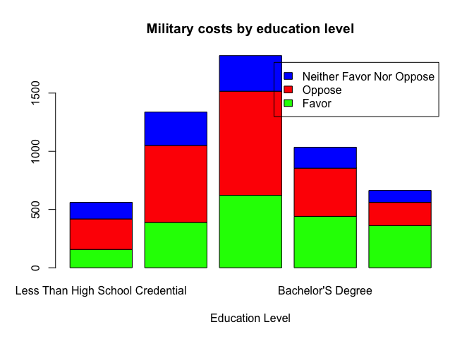

# Is there a relationship between education level and willingness to diminish the government deficit by cutting military costs?
2014/10/19  

### Introduction:

The rise of military costs and the wars waged by the US have been a constant source of political discussion. Here we want to look at the responses to the ANES survey and try to understand if there is an association between the education level and willingness to cut military costs to diminish government deficit.

Understanding the population relation to this question might offer another solution to the rising government deficit and groups that should be the main recipients of the message for people that want to convince others that cutting the military cost is beneficial to the government.

### Data:

The data used here is the *ANES 2012 Time Series Study*:

> The American National Election Studies (ANES; [www.electionstudies.org](www.electionstudies.org)). The ANES 2012 Time Series Study [dataset](http://electionstudies.org/studypages/anes_timeseries_2012/anes_timeseries_2012.htm). Stanford University and the University of Michigan. 

The data was collected from surveys pre and post the 2012 elections, part in face to face interviews and part in internet based questionnaires. Collection started on September 2012 and went on until January 2013.

There were 2054 respondents for the face-to-face questionnaire, 3860 for the web based one.

The variables in use will be the respondent's education level (dem_edugroup - ordinal categorical) and it's opinion on whether the government should diminish investments in the military to lower the current deficit (BUDGET_RDEFMIL - categorical).

The study is an observational study since users were only given a questionnaire to answer and there is no control group or blocking to make sure there aren't other variables affecting their positions.

The population of interest are all U.S. eligible voters and the study sampled people from this part of the population. Given more than half of the sample answered the questionnaire over the internet it's important to consider that these people have a computer connected to the internet available for them and they know how to operate it, something that might not be that normal for the general public that would be polled for the elections, so there might be some bias there for the people who have a computer, internet access and decided they would like to participate in the survey.

Given this is an observational study, it's only possible to assume association between the variables and not causation.

### Exploratory data analysis:

We starting exploring the dataset by loading the data:


```r
load(url("http://bit.ly/dasi_anes_data"))
summary(anes$budget_rdefmil)
```

```
##                    Favor                   Oppose Neither Favor Nor Oppose 
##                     1986                     2447                     1027 
##                     NA's 
##                      454
```

```r
specific <- anes[,c("dem_edugroup", "budget_rdefmil")]
specific <- specific[complete.cases(specific),]
```

Once we load the data, we create a separate dataset with only the variables we're interested in and then remove the NAs from it. We had 495 observations that did not fill one option or the other, so from the 5914 original observations our dataset now has 5419.

Let's look at the summary of the education group variable:


```r
summary(anes$dem_edugroup)
```

```
##            Less Than High School Credential 
##                                         622 
##                      High School Credential 
##                                        1442 
## Some Post-High-School, No Bachelor'S Degree 
##                                        1972 
##                           Bachelor'S Degree 
##                                        1120 
##                             Graduate Degree 
##                                         708 
##                                        NA's 
##                                          50
```

Most of the respondents have finished at least high school, only 622 (11%) did not complete it.

Now let's look at the budget costs summary:


```r
summary(anes$budget_rdefmil)
```

```
##                    Favor                   Oppose Neither Favor Nor Oppose 
##                     1986                     2447                     1027 
##                     NA's 
##                      454
```

Here we have _36%_ of the population in favor of cutting military costs and _44%_ opposing it with _20%_ having no specific opinion on it.

Now let's look at how the data presents itself, starting with a barplot:


```r
counts <- table(specific$budget_rdefmil, specific$dem_edugroup)
barplot(counts, main="Military costs by education level",
         xlab="Education Level", col=c("green", "red", "blue"),
         legend = rownames(counts))
```

 

Looking at this plot we can see that it seems like the proportion of people in favor grows as the education level grows up. To verify proportion in categorical variables, we're better off doing a mosaic plot, let's build one now:


```r
mosaicplot(formula=specific$dem_edugroup ~ specific$budget_rdefmil, color=c("green", "red", "blue"), xlab="Education Level", ylab="Military budget cut", main="Education level by military budget cut")
```

 

With the mosaicplot the proportions are much more visible and it seems like there is a trend there, as the education level grows, the amount of people in favor of cutting military costs grows as well.

### Inference:

The hypothesis here is that:

* H<sub>0</sub>: There is no relationship between education level and willingness to cut military costs;
* H<sub>A</sub>: There is a relationship between education level and willingness to cut military costs;

What we want to accomplish here is to figure out if there is a relationship between the two categorical variables we have. Since this is a comparison between two categorical variables with many different levels (5 for education levels and 3 for military budget cut) our only option is the chi-square independence test.

The conditions for a chi-square independence test are as follows:

* Independence - the study data we're using contains 5419 observations, this is definitely less than 10% of the US registered voter population and each observation constitutes a single cell at our contingency table;
* Sample size - each cell of our contingency table also has more than 5 observations, so this condition holds as well;

Let's do the computation:


```r
chisq.test(specific$dem_edugroup, specific$budget_rdefmil)
```

```
## 
## 	Pearson's Chi-squared test
## 
## data:  specific$dem_edugroup and specific$budget_rdefmil
## X-squared = 182.7, df = 8, p-value < 2.2e-16
```

With this result, given our _pvalue_ is much smaller than the 5% significance level we decided to use, we reject H<sub>0</sub> and accept the alternative hypothesis, there is a relationship between education level and military budget cut.

Given there was no other method available to perform this inference, we can't make any comparisons.

### Conclusion:

Knowing that there is a relationship between these variables we can conclude that the rise in favoring the cuts is associated with the education level. Still, it's impossible to imply causation for this since we're using an observational study for it, so far, all we can assume is that there is a positive relationship between these options.

There are other factors that could also lead to this, for instance, parts of the population with lower education level might see the opportunities offered by the military as their best option if they can't pay for college.

A better way to understand what's happening here could be doing another study trying to figure out why people are in favor or not and use this to perform blocking at an actual experiment. Also, for those interested in nudging the population at one direction or the other could try to move the _20%_ of the population that did not make a decision on this to move to one camp or the other.

### Appendix:

Here's a page of the dataset used for this project:

```
                                  dem_edugroup           budget_rdefmil
2             Less Than High School Credential                    Favor
3  Some Post-High-School, No Bachelor'S Degree                   Oppose
4  Some Post-High-School, No Bachelor'S Degree Neither Favor Nor Oppose
5                       High School Credential                   Oppose
6             Less Than High School Credential                   Oppose
7             Less Than High School Credential Neither Favor Nor Oppose
8             Less Than High School Credential                   Oppose
9                            Bachelor'S Degree                    Favor
10                             Graduate Degree                    Favor
11                           Bachelor'S Degree                    Favor
12                             Graduate Degree                   Oppose
13 Some Post-High-School, No Bachelor'S Degree                   Oppose
14 Some Post-High-School, No Bachelor'S Degree Neither Favor Nor Oppose
15                           Bachelor'S Degree                   Oppose
16                             Graduate Degree                   Oppose
17                             Graduate Degree                   Oppose
18                      High School Credential                   Oppose
19            Less Than High School Credential Neither Favor Nor Oppose
20            Less Than High School Credential                    Favor
21 Some Post-High-School, No Bachelor'S Degree                   Oppose
22                      High School Credential Neither Favor Nor Oppose
23                      High School Credential                    Favor
25            Less Than High School Credential                   Oppose
27 Some Post-High-School, No Bachelor'S Degree                   Oppose
28 Some Post-High-School, No Bachelor'S Degree                   Oppose
29            Less Than High School Credential                   Oppose
30 Some Post-High-School, No Bachelor'S Degree                    Favor
31                           Bachelor'S Degree                    Favor
32 Some Post-High-School, No Bachelor'S Degree                   Oppose
33 Some Post-High-School, No Bachelor'S Degree                    Favor
34                      High School Credential                    Favor
35                      High School Credential Neither Favor Nor Oppose
36 Some Post-High-School, No Bachelor'S Degree                   Oppose
37 Some Post-High-School, No Bachelor'S Degree Neither Favor Nor Oppose
38            Less Than High School Credential                    Favor
39 Some Post-High-School, No Bachelor'S Degree                    Favor
40 Some Post-High-School, No Bachelor'S Degree                   Oppose
41                           Bachelor'S Degree                   Oppose
42                           Bachelor'S Degree                   Oppose
43                           Bachelor'S Degree                   Oppose
44                           Bachelor'S Degree                   Oppose
45                      High School Credential                   Oppose
46                           Bachelor'S Degree                   Oppose
47                           Bachelor'S Degree                   Oppose
48                           Bachelor'S Degree                   Oppose
49 Some Post-High-School, No Bachelor'S Degree                   Oppose
50 Some Post-High-School, No Bachelor'S Degree                   Oppose
51 Some Post-High-School, No Bachelor'S Degree                    Favor
52 Some Post-High-School, No Bachelor'S Degree                   Oppose
53 Some Post-High-School, No Bachelor'S Degree                    Favor
```
